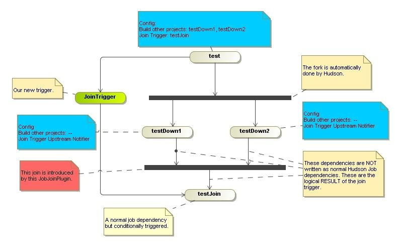
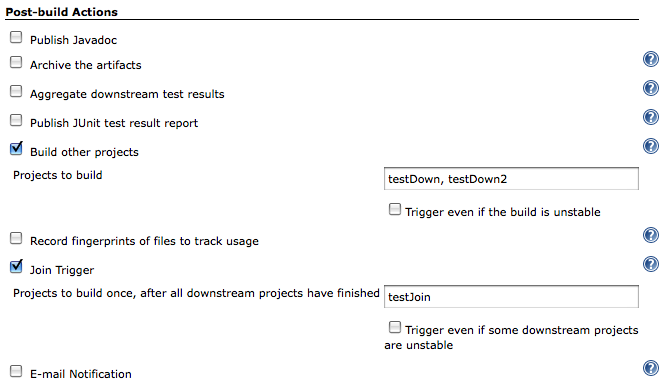
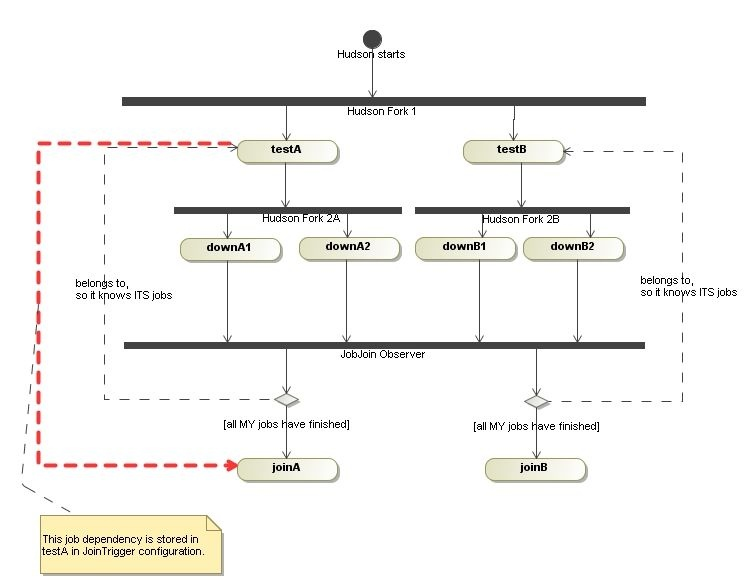
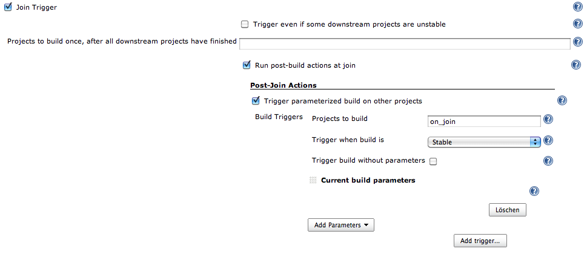

# Join Plugin for Jenkins

  
This plugin allows a job to be run after all the immediate downstream
jobs have completed.   In this way,  the execution can branch out and
perform many steps in parallel, and then run a final aggregation step
just once after all the parallel work is finished.  
The plugin is useful for creating a 'diamond' shape project dependency.
  This means there is a single parent job that starts several downstream
jobs.   Once those jobs are finished, a single aggregation job runs.  
More complex interactions are not possible with this plugin.  
  
The downstream projects are specified using Hudson's normal project
relationship mechanism.   

  
  

## Example:

Our build consists of four jobs - test, testDown1, testDown2 and
testJoin. Basically they have to run in sequence, but testDown1 and
testDown2 could be run in parallel.(Maybe something like build - run
tests - metrics - release). The logical overview of our jobs would be:  
  
First we have to define our four jobs. With normal Hudson job dependency
("*Build other projects*") we add testDown1 and testDown2 to test. This
is the fork in the diagram.

Adding the testJoin in that way is not possible, because would start it
immediately after finishing the test-job. This is where this plugin
jumps into: the test-job configures the Join Trigger and specifies the
job to run after the join. The plugin is now able to start the testJoin
job - but it needs to know when the forked jobs have finished. That's
why we add the Join Trigger Upstream Notifier to these jobs.

Now the plugin gets the list of all forked jobs by its base job (test),
gets informed by all forked jobs, waits for all "own" jobs to be
completed and then starts the final job (testJoin).

### Configuration of the base job (test):

  
  

### Configuration of forked jobs - testDown1 + testDown2:

No configuration required.  

### Having multiple forks&joins in Hudson

The first example shows the use of this plugin for creating one
'diamond' job dependency. Having multiple diamonds is also easy (I
whished it would be in real world

) But the resulting logical overview is a little bit different:
  
You have two base jobs (testA and testB) and Hudson forks them in the
first step. Each of the diamonds has its own fork (2A and 2B). But ALL
forked jobs inform the SAME observer (here shown as join bar *JobJoin
Observer*). This ONE observer has two joins configured: the A-diamond
and the B-diamond. And each fragment waits for recieving all the
notifications it needs.

### Example:

1.  Hudson starts
2.  Hudson starts testB
3.  Hudson starts testA
4.  testA finishes
5.  Hudson starts downA1
6.  Hudson starts downA2
7.  testB finishes
8.  Hudson starts downB2
9.  Hudson starts downB1
10. downA2 finishes
11. downA2 notifies the plugin
12. PlugIn: downA2 belongs to diamond A
13. PlugIn: diamond A requires downA1 and downA2
14. PlugIn: diamond A is missing downA1, so do nothing
15. downB2 finishes
16. downB2 notifies the plugin
17. PlugIn: downB2 belongs to diamond B
18. PlugIn: diamond B requires downB1 and downB2
19. PlugIn: diamond B is missing downB1, so do nothing
20. downB1 finishes
21. downB1 notifies the plugin
22. PlugIn: downB1 belongs to diamond B
23. PlugIn: diamond B requires downB1 and downB2
24. PlugIn: all notifications recieved, so start joinB
25. downA1 finishes
26. downA1 notifies the plugin
27. PlugIn: downA1 belongs to diamond A
28. PlugIn: diamond A requires downA1 and downA2
29. PlugIn: all notifications recieved, so start joinA

### Build Parameters

By default, parameters of the current build will not be passed to the
join project (like the default build trigger). If you want to do this,
choose "Post-Join Action" -\> "Trigger parameterized build on other
project" and then choose "Current Build Parameters" (or other parameters
you want to use).  
For example:

Although you can specify in your Post-Join Actions build triggers other
than "Stable", only "Stable" seems to work.

